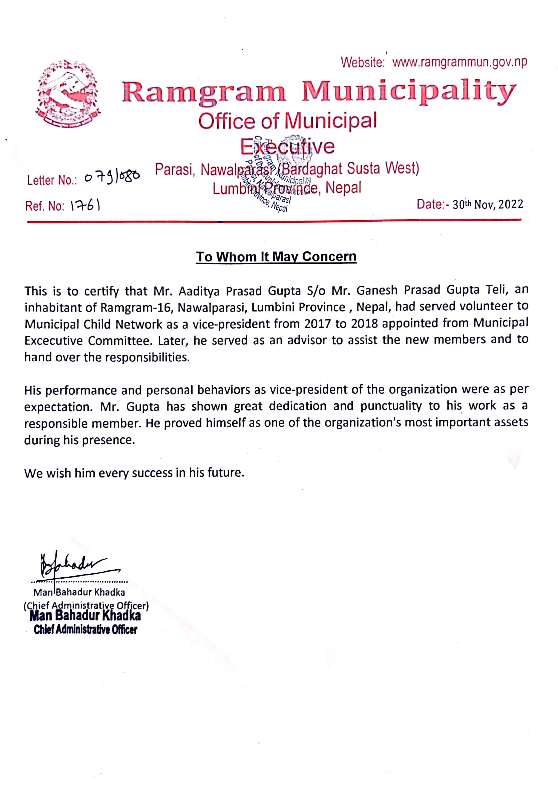

# Community_service

I have worked as a vice president of the child club from the age of fourteen, where I engaged in different programs organized by various NGOs and INGOs, such as UNESCO Nepal, ABC Nepal, etc. Due to our great effort and commitment, we were able to announce our municipality as a Child-Friendly Local Governance (CFLG) municipality in the country, which was a great accomplishment for the club and the municipality. Further, it was time to remake the committee of the club. Due to my performance, the municipal decision was to elect me as the new president. However, due to my strong interest in further study, I did not participate as an active club member; however, I continue to work as an advisor. The certificate of my community service is shown below:

